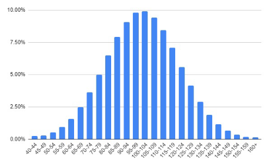
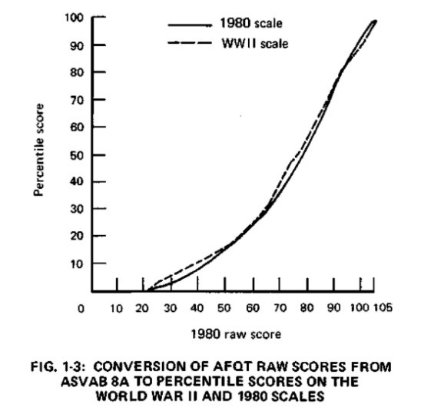

# Army General Classification Test (AGCT)

## Introduction

The **Army General Classification Test (AGCT)** is a high-accuracy IQ test originally developed by the **US Army** for job assignment purposes. Now in the public domain, this self-hostable, automated version of the AGCT allows individuals to take the test and evaluate their abilities using the original format. 

The AGCT was created to assess a wide range of cognitive abilities in soldiers, including **verbal**, **quantitative**, and **spatial** reasoning. Over time, it has become a highly regarded test in the field of psychometrics and is still recognized by **Mensa**, **Intertel**, and other high-IQ societies for its accuracy and reliability.

I am thankful for **Polar** from r/cognitivetesting, who previously automated the test on **cognitivemetrics.co**, and this project is built upon that work. This version is simply a self-hostable option for individuals who want more privacy while taking the test.
---

## Test Overview

The **AGCT** evaluates three key cognitive areas:
- **Verbal (V)**: Tests vocabulary, analogies, and language comprehension.
- **Quantitative (Q)**: Measures mathematical problem-solving and numerical reasoning.
- **Spatial (S)**: Assesses visual-spatial reasoning, pattern recognition, and puzzle-solving skills.

The test lasts for **40 minutes** and consists of multiple-choice questions designed to minimize the impact of prior knowledge. It is intended to measure a person’s raw intellectual abilities without the influence of education or cultural background.

### Key Test Information:
- **Test Duration:** 40 minutes
- **Abilities Tested:** Verbal, Quantitative, and Spatial
- **Score Distribution:** Standard deviation of **15**
- **Reattempt Policy:** Only one attempt allowed; reattempts are invalid. Wait at least 6 months between attempts for an accurate score.
- **Allowed Materials:** Scratch paper
- **Prohibited Materials:** Calculators
- **Test Language:** Intended for native English speakers

---

## Strong Reliability and Validity

The **AGCT** is known for its **strong reliability** and **construct validity**, making it one of the most accurate IQ tests in existence. Its **g-loading** (general intelligence correlation) has been calculated at **~0.925**.

### Historical Context:
The AGCT was developed by the US Army for the purpose of job assignment among soldiers, undergoing constant improvements and revisions over time to ensure its accuracy. Amassing a massive sample of more than 12 million soldiers, this transcends the samples of modern professional tests by over 5,000 times. This ensures that its norms adhere to the utmost rigor and is a reason why the AGCT format is regarded as one of the most accurate IQ tests ever created. Its questions are designed to minimize prior knowledge from education and culture, due to drafted soldiers being of all classes and lifestyles.

---

### Images:

